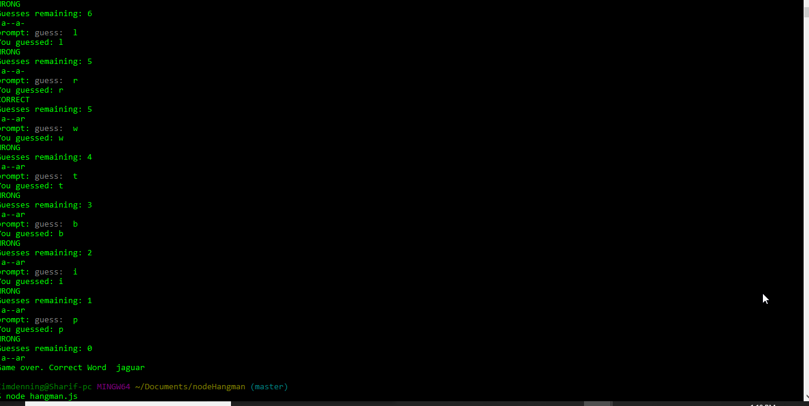

# nodeHangman

This project is a nodeJs hangman game that uses constructors and multiple files operating togethers. 

 It is useful for showing the various ways "require" and constructor functions can be used.

